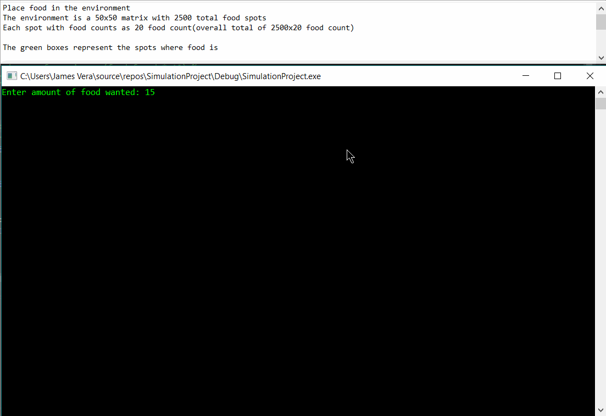

# SimulationProject
*Place food in the environment
*The environment is a 50x50 matrix with 2500 total food spots
*Each spot with food counts as 20 food count(overall total of 2500x20 food count)
*
*The green boxes represent the spots where food is
*
*Next, decide how many different spicies you want in your simulation
*
*Specify amount of food each individual in a species will need to survive, reproduce
*Their size--Example: worm/lizard(0) mice/pigeon(1) cat/small dog(2) pitbull(3) hyena(4) deer(5) tiger(6) bear(7) elephant(8) dragon(9)
*
*Specify if they are a meat eater
*If they are, they can only feed on other species. Food from species count as 10x their size
*
*Now observe the changes in population as they fight for food and survival! (Still working on improvements!)

